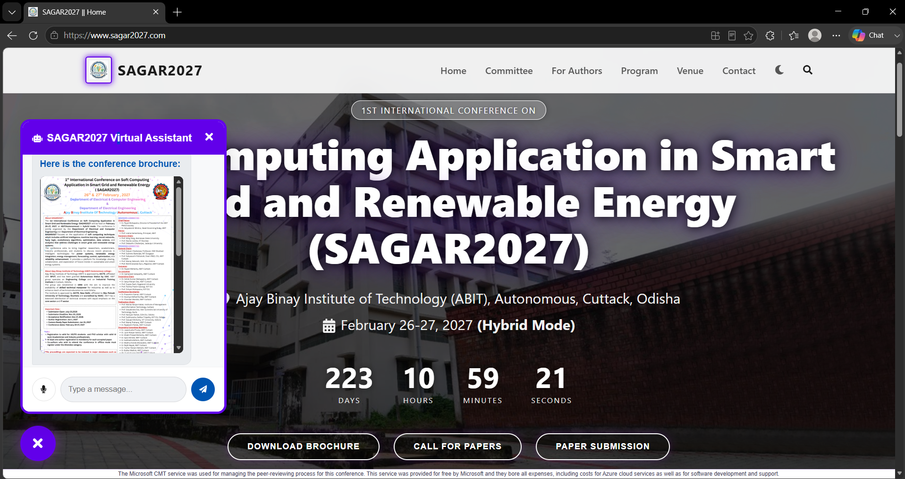

# ABIT Conference Paper Website 📝




This repository contains the source code for the official ABIT Conference website, a platform for providing information about the conference, including schedules, speakers, and submission guidelines.

## 🌐 Live Demo

- **Web Domain:** [https://www.sagar2027.com](https://www.sagar2027.com)
- **Vercel Domain:** [https://sagar2027.vercel.app](https://sagar2027.vercel.app)

## ℹ️ About the Conference

The **1st International Conference on Soft Computing Application in Smart grid and Renewable Energy (SAGAR2027)** will be held on **February 26-27, 2027**, at the **ABIT (Autonomous) Campus** in a hybrid (online/offline) mode.

The conference focuses on the fusion of research in areas like evolutionary algorithms, fuzzy set theory, data science, and machine learning, and their application in smart grids and renewable energy. It aims to provide a platform for sharing knowledge and fostering innovation in these critical fields.

## 🚀 Key Features

-   **Dynamic Homepage**: Engaging hero section with a countdown timer and carousel. 🎠
-   **Comprehensive Author Information**: Dedicated sections for paper submission, registration, and presentation guidelines. ✍️
-   **Detailed Program Schedule**: Easy access to the conference schedule, keynote talks, and proceedings. 🗓️
-   **Committee Listings**: Separate, organized views for the Advisory, Program, and Technical committees. 👥
-   **Venue & Accommodation**: Information about the conference venue and nearby accommodations. 🏨
-   **Interactive Elements**: Includes a chatbot, back-to-top button, and a responsive mobile-friendly design. 📱

## 🏗️ Project Architecture

The project is built with React and Vite, following a component-based architecture that promotes reusability and separation of concerns.

-   **`public/`**: Contains static assets like `index.html`, favicons, and images.
-   **`src/`**: The main application source code.
    -   **`assets/`**: Holds static resources like images and documents.
    -   **`components/`**: Contains all reusable UI components (e.g., `Header`, `Footer`, `Chatbot`), organized by feature.
    -   **`data/`**: Stores all the application's content in static JSON files.
    -   **`pages/`**: Top-level components for each main route (e.g., `Home`, `Committee`, `Venue`).
    -   **`Router.jsx`**: Defines all client-side routes using `react-router-dom` with `React.lazy()` for efficient code-splitting.
    -   **`App.jsx`**: The root component, which sets up the global layout and routing.
    -   **`main.jsx`**: The entry point of the application.

## 💾 Data Management

The application's content is managed through a set of static JSON files located in the `src/data/` directory. Each JSON file corresponds to a specific section or component of the website (e.g., `committee.json`, `hero.json`, `programSchedule.json`). For instance, `welcome.json` contains the main descriptive text about the event, which is displayed on the homepage.

Components that require data simply import the relevant JSON file and map over its contents to render the UI. This decoupled approach makes it easy to update the website's content without touching the component logic.

```javascript
// Example: src/components/Committee/ProgramCommittee.jsx
import committeeData from '../../../data/committee.json'

const ProgramCommittee = () => {
  const { programCommittee } = committeeData
  // ... render the committee data
}
```

## 🛠️ Technologies Used

-   **Frontend**: React.js, Vite
-   **Routing**: React Router
-   **Linting**: ESLint
-   **Deployment**: Vercel

## 🏁 Getting Started

To get a local copy up and running, follow these simple steps.

### Prerequisites

-   Node.js (v18.x or later)
-   npm

### Installation & Execution

1.  Clone the repo
    ```sh
    git clone https://github.com/your-username/abit-conference-paper.git
    ```
2.  Install NPM packages
    ```sh
    npm install
    ```
3.  Run the development server
    ```sh
    npm run dev
    ```
4.  Open your browser and navigate to `http://localhost:5173`.

Enjoy exploring the codebase! 🚀
